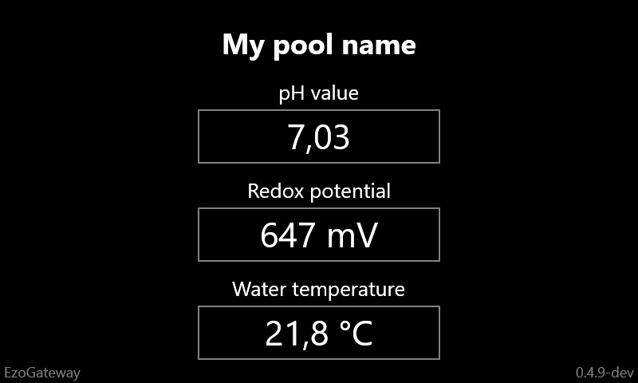

## Project in BETA state :construction:
```diff
! Productive use is not recommended!
```

---

")
# EzoGateway
Open source UWP App, to brings the Atlas Scientific EZO™ devices in the __Internet of Things__. Per __REST API__ you can fetch live measdata and calibrate connected sensors.
Ideal for monitoring water quality in your pool.


[](https://ci.appveyor.com/project/100prznt/ezogateway)   [](https://github.com/100prznt/EzoGateway/issues)   [](#) 

## What can the EzoGateway do?
My use case for the EzoGateway is the monitoring of the water values of my own pool. The EzoGateway provide a REST API, which (in my case) is called by the home automation system.
The values can also be displayed directly via the web interface or transferred to a Siemens LOGO! PLC.

## How to install?
1. Download the latest release from the [release feed](https://github.com/100prznt/EzoGateway/releases/latest) (You need the \*.appx file, find on __Assets__)
2. Open the __Windows Device Portal__, by default you found it under port 8080 (e.g. `http://<IP of your RaspberryPi>:8080`)
3. Navigate to __Apps__ -> __Apps Manager__
4. Select the downloaded application package (\*.appx file from step 1) and click __Install__ Before doing so, make sure that no old version of EzoGateway is running or installed!
5. Mark the EzoGateway App to default __Startup__ app (maybe you must reload the Apps manager page, to see the EzoGateway in the list)
6. If the EzoGateway App not starts automaticaly click __Action__ -> __Start__
7. Wait a few seconds and go to the __EzoGateway - Settings__ page, located under `http://<IP of your RaspberryPi>:591/web/sys/config.html`
8. Apply your preferred settings and enjoy... :rocket:

## How to use?

### API Reference
* Wiki: [API Reference](https://github.com/100prznt/EzoGateway/wiki/API-Reference)

### Build-In GUI
The application itself has a grafic user interface that displays the current measurement data.



### Web interface
You found the web interface under: `http://<EzoGateway IP>:591/web/live.html`
This interface allow you to show live measdata, configure the EzoGateway and perform calibrations.


### Siemens LOGO! interface
The Siemens LOGO! interface can be activated and configured in the settings. The IP address of the LOGO! and the VM addresses of the corresponding blocks in the LOGO! program must be specified.

For a detailed documetation of the Siemens LOGO! interface see the Wiki-Page.
* Wiki: [Siemens LOGO! interface](https://github.com/100prznt/EzoGateway/wiki/Siemens-LOGO!-interface)

Example program on the Siemens LOGO! PLC which shows the measured data on the display.


## Hardware
### Tentacle T3
For fast hardware integration there is a cool project from [Whitebox](https://github.com/whitebox-labs). The [Tentacle T3 HAT](https://github.com/whitebox-labs/tentacle-raspi-oshw) accepts three Atlas Scientific EZO™ devices, two of them are electrically isolated.

### EzoGateway PCB
An optimized PCB for the EzoGateway is currently being planned, details can be found under [hardware/](hardware/).

")

## Releases
This project build on the continuous integration (CI) platform [AppVeyor](https://www.appveyor.com/) and released in the [Release-Feed](https://github.com/100prznt/EzoGateway/releases).

[](https://ci.appveyor.com/project/100prznt/ezogateway)  
[](https://ci.appveyor.com/project/100prznt/EzoGateway/build/tests)

[](https://github.com/100prznt/EzoGateway/releases/latest)  
[](https://github.com/100prznt/EzoGateway/releases) (Pre-)Release

## Community
Found this project on the german [Poolpowershop-Forum](https://www.poolpowershop-forum.de/).
* [Wasserwerte mit Raspberry Pi messsen (REST API, Siemens LOGO!)](https://www.poolpowershop-forum.de/wasserpflege-poolpflege-hilfe-bei-wasserproblemen-im-pool/48401-wasserwerte-mit-raspberry-pi-messsen-rest-api-siemens-logo.html)

## Credits
This app is made possible by contributions from:
* [Elias Rümmler](http://www.100prznt.de) ([@rmmlr](https://github.com/rmmlr)) - core contributor

### Open Source Project Credits

* [Rca.EzoDeviceLib](https://github.com/100prznt/Rca.EzoDeviceLib) - UWP driver library for the Atlas Scientific EZO™ devices
* [Sharp7](http://snap7.sourceforge.net/) C# implementation of the S7Protocol
* [Newtonsoft.Json](https://www.newtonsoft.com/json) Object serialization for REST API and local storage
* [UIkit](https://github.com/uikit/uikit) Style up the web interface
* [jQuery](https://github.com/jquery/jquery) Web interface data exchange

## License
The EzoGateway App is licensed under [MIT](http://www.opensource.org/licenses/mit-license.php "Read more about the MIT license form"). Refer to [LICENSE.txt](https://github.com/100prznt/EzoGateway/blob/master/LICENSE.txt) for more information.

## Contributions
Contributions are welcome. Fork this repository and send a pull request if you have something useful to add.
